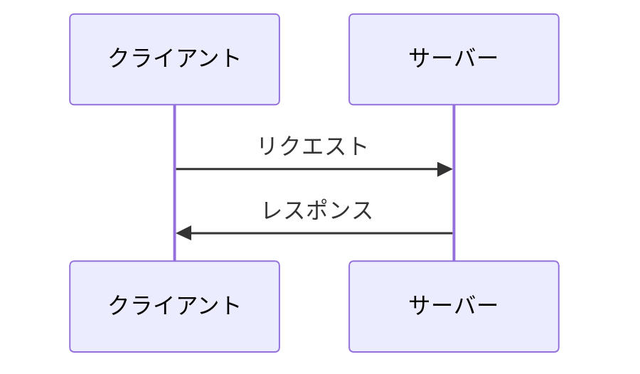
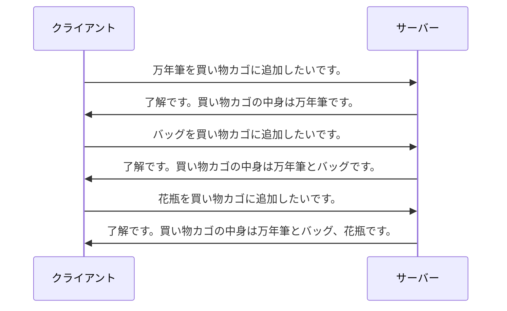
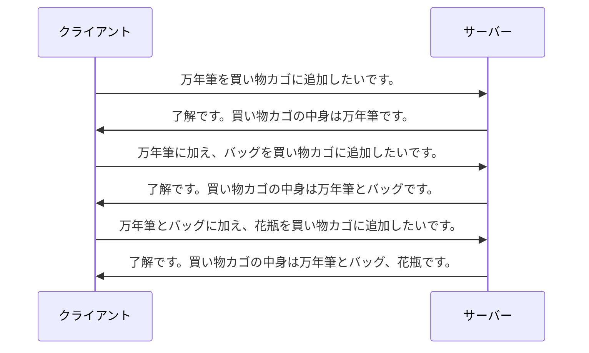

# HTTPとは

本章では、HTTPの全体像を解説します。

HTTPとは、**Web上でやりとりするリソースの表現を、クライアントとサーバー間でやりとりするためのプロトコル**です。

リソースとは、Web上に存在する、名前を持ったあらゆる情報のことです。たとえば、群馬県の天気予報などです。

リソースの表現とは、クライアントとサーバー間でやりとりするデータのことです。たとえば、天気予報リソースはHTMLという表現でやりとりできます。他にも画像やJSONなど、1つのリソースに対して複数の表現をとれます。

## TCP/IP

HTTPはTCP/IPをベースにしたプロトコルです。

TCP/IPは**インターネットの基盤を構成するネットワークプロトコル**です。TCP/IPはTCPとIPのみを示しているわけではなく、HTTPなど他のプロトコルも含みます。

TCP/IPは階層型になっています。

| 階層                           | 主な役割                                                     | 代表的なプロトコル |
| ------------------------------ | ------------------------------------------------------------ | ------------------ |
| アプリケーション層             | アプリケーションごとに固有な決まり事を定める                 | HTTP, DNS, TLS     |
| トランスポート層               | ノード間のデータ転送の信頼性を確保するための決まり事を定める | TCP, UDP           |
| インターネット層               | ネットワーク間の通信のための決まり事を定める                 | IP, ARP, ICMP      |
| ネットワークインターフェース層 | 直接的に接続されたノード間の通信のための決まり事を定める     | イーサネット       |

## アーキテクチャスタイル

HTTPはアーキテクチャスタイルに**クライアント・サーバー**を採用しています。

WebブラウザなどのクライアントがWebサーバーに接続し、各種のリクエストを出してレスポンスを受け取る仕組みです。

## ステートレス

HTTPはステートレスなプロトコルです。

ステートレスとは、**サーバーがクライアントのアプリケーション状態を保存しない制約**のことです。といっても少しわかりづらいので、ステートレスの逆、ステートフルなやりとりから順に見ていきましょう。題材はよくある買い物カゴ機能です。

直感的に思えます。次はステートレスです。

リクエストが一見冗長になっているところがポイントです。ステートレスなやりとりでは、毎回買い物カゴの全商品を繰り返さなければいけません。一方でステートフルなやりとりでは、差分を伝えるだけで済んでいます。

これは「クライアントの現在の買い物カゴの中身」というアプリケーション状態をサーバーが保存することで実現しています。アプリケーション状態とはセッション状態とほぼ同じ意味で、システムにログインしてからログアウトするまでの一連の操作の間の状態のことです。

ステートレスの利点は、サーバーが単純になることです。アプリケーション状態をサーバーが管理しなくていいからです。サーバーが単純なのでスケールアウトも比較的容易に行えます。
